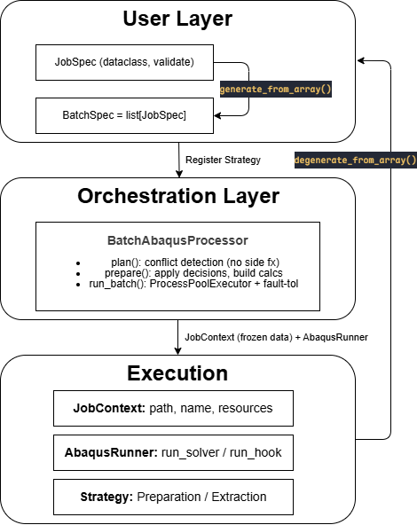

<div align="center">

# ABQ-FLOW

**Modular batch-processing framework for [Abaqus FEA](https://www.3ds.com/products/simulia/abaqus) based on [python](https://www.python.org/).**
Typed job specs, strategy-pattern workflows, fault-tolerant parallel execution, resource-aware scheduling — no more hand-crafted launch scripts.

[](LICENSE)   

English | [简体中文](../README.zh-CN.md) 

</div>

## Features

- **⚒️ Strategy-pattern workflows**: compose preparation, extraction, and simulation steps into reusable pipelines
- **📗 Typed configuration**: `JobSpec` dataclasses validate before execution, no silent `KeyError` at runtime
- **🔒 Fault-tolerant parallel execution**: `ProcessPoolExecutor` + `JobOutcome` envelope; one failed job won't kill the batch
- **💻 Extensible**: register custom preparation strategies without modifying framework code

## Architecture

<!-- ```
┌──────────────────────────────────────────────────┐
│ User Layer                                        │
│   JobSpec (dataclass, validate + deep-copy)       │
│   BatchSpec = list[JobSpec]                       │
└────────────────┬─────────────────────────────────┘
                 │ StrategyRegistry.build(spec)
┌────────────────▼─────────────────────────────────┐
│ Orchestration Layer  BatchAbaqusProcessor          │
│   plan()      — conflict detection (no side fx)   │
│   prepare()   — apply decisions, build calcs      │
│   run_batch() — ProcessPoolExecutor + fault-tol   │
│   ResourcePlanner — CPU / license constraints     │
└────────────────┬─────────────────────────────────┘
                 │ JobContext (frozen data) + AbaqusRunner
┌────────────────▼─────────────────────────────────┐
│ Execution Layer                                    │
│   JobContext   — paths, name, resources            │
│   AbaqusRunner — run_solver / run_hook             │
│   Strategy     — depends only on (ctx, runner, log)│
└──────────────────────────────────────────────────┘
``` -->




## Installation

```bash
pixi add --pypi "ABQflow @ git+https://github.com/Yutu0k/ABQflow.git"
```

**Prerequisites:** Abaqus (with `abaqus` on PATH), Python ≥ 3.9. Optional: [`abqpy`](https://github.com/haiiliin/abqpy) for running scripts directly with `python` instead of the Abaqus kernel.

## How to use?

### Single parameterized job

```python
from ABQflow import BatchAbaqusProcessor, JobSpec, PreparationSpec, HookSpec

spec = JobSpec(
    job_name = "planar_stress",
    workflow = "modular",
    preparation = PreparationSpec(
        kind = "inp_based",
        source_path = "./examples/SingleParameterizedJob/cae_file/planar_stress_template.inp",
        params = {
            "youngs_modulus": 210000,
            "load_magnitude": 2000,
        }
    ),
    post_extraction = [
        HookSpec(
            script_path = "./examples/SingleParameterizedJob/cae_file/get_max_stress_mises.py",
            tasks = [
                {"result_name": "max_stress_mises",},
                {"result_name": "max_displacement",},
            ]
        )
    ]
)

processor = BatchAbaqusProcessor(
    batch_data = [spec],
    base_output_dir = ("./examples/SingleParameterizedJob/output"),
    cpus_per_job = 4,
    duplicate_mode = "overwrite",
)
outcomes = processor.run_batch(num_parallel_jobs=1)

for oc in outcomes:
    print(f"{oc.job_name}: {oc.status} → {oc.results}")
```

### Batch parameterized job

```python
import numpy as np
from ABQflow import BatchAbaqusProcessor, JobSpec, PreparationSpec, HookSpec
from ABQflow import generate_from_array, degenerate_from_array

param_names = ['youngs_modulus', 'load_magnitude']
param_values = np.array([
	[200000, 2000],
	[210000, 3000],
	[220000, 4000],
	[230000, 5000]
])

base_job_spec = JobSpec(
    job_name = "planar_stress_batch",
    workflow = "modular",
    preparation = PreparationSpec(
        kind = "inp_based",
        source_path = "./examples/BatchParameterizedJob/cae_file/planar_stress_template.inp",
    ),
    pre_extraction = [
        HookSpec(
            script_path = "./examples/BatchParameterizedJob/cae_file/get_total_mass.py",
            tasks = [
                {"result_name": "total_mass",},
            ]
        )
    ],
    post_extraction = [
        HookSpec(
            script_path = "./examples/BatchParameterizedJob/cae_file/get_max_stress_mises.py",
            tasks = [
                {"result_name": "max_stress_mises",},
                {"result_name": "max_displacement",},
            ]
        )
    ]
)

spec_list = generate_from_array(
    samples_array = param_values,
    param_names = param_names,
    base_spec  = base_job_spec
)

proc = BatchAbaqusProcessor(specs, './output', cpus_per_job=4)
outcomes = proc.run_batch(num_parallel_jobs=2)

# Get a 2D numpy array of results
arr = degenerate_from_array(outcomes = outcomes, output_names = ["total_mass", "max_stress_mises", "max_displacement"])
print(arr)  # shape (4, 3)
```

### Monolithic script

<!-- ```python
jobs = [{
    'job_name': 'full_model',
    'workflow': 'monolithic',
    'script_path': './build_and_run.py',
    'params': {'length': 100, 'mesh_size': 2.0},
}]

proc = BatchAbaqusProcessor(jobs, './output', cpus_per_job=4)
outcomes = proc.run_batch(num_parallel_jobs=1)
``` -->

TODO


## Hook Scripts

Extraction hook should follow the retionales below:

- Remember scripts are handed to `abaqus python interpreter`. Make sure no packages other than Python's built-in packages are imported.
- The exported results should use `sys.__stderr__.write()` and include header `===ABQ_RESULT_BEGIN===` and footer `===ABQ_RESULT_END===`
- Any fail can be manually tested with:

    ```bash
    python extraction_script.py --result_path path_to_result --tasks_json path_to_json_for_job
    ```

### Quick Example
```python
# my_extract.py
import argparse, sys, json
from odbAccess import openOdb

def extract_from_odb(args):
    try:
        with open(tasks_json_path, 'r', encoding='utf-8') as f: 
            task_list = json.load(f)

        odb = openOdb(args.odb_path)
        results = {}

        for task in task_list:
            name = task['result_name']
            try:
                results[name] = 123.45  # your extraction logic
            except Exception:
                results[name] = None
        
        odb.close()
        sys.__stdout__.write(f"===ABQ_RESULT_BEGIN===\n{json.dumps(results)}\n===ABQ_RESULT_END===\n")
    
    except Exception as e:
        sys.__stderr__.write(f"Fatal error in my_extract.py: {e}\n")
        sys.exit(1)

if __name__ == "__main__":
    parser = argparse.ArgumentParser()
    parser.add_argument('--odb_path', required=True)
    parser.add_argument('--tasks_json', required=True)
    args, unknown = parser.parse_known_args()
    extract_from_odb(args)

```


## License Token Planning

```python
from abaqus_batch_pack import solver_tokens, plan_parallelism

# Tokens for 4 CPUs: ceil(5 * 4^0.422) = 9
print(solver_tokens(4))  # → 9

# Max parallel jobs on a 16-core machine with 4 CPUs/job
print(plan_parallelism(requested=8, cpus_per_job=4))  # → 3
```

Formula: `T(n) = ⌈5 × n^0.422⌉` (Abaqus official)


## License

MIT License | See [LICENSE](LICENSE) for more details
